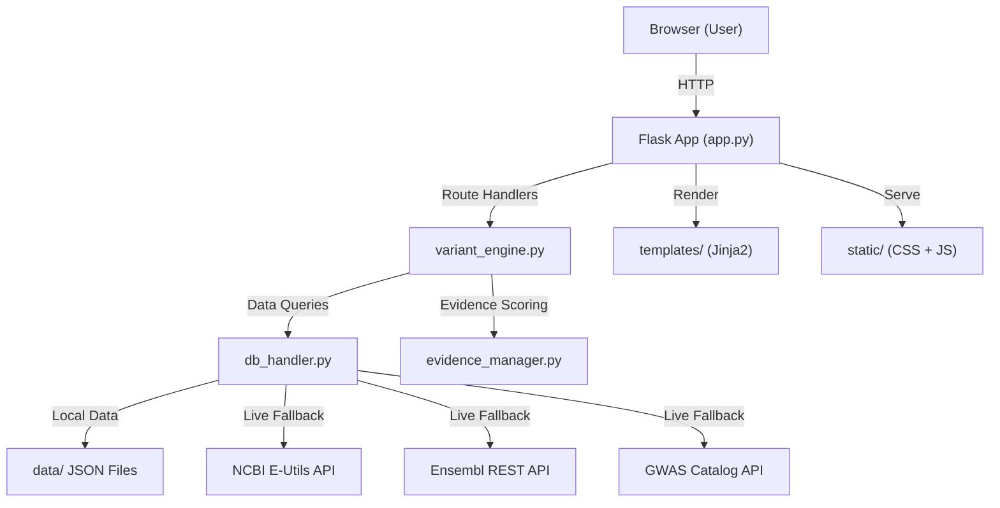

# GenomeVAP — Complete Project Handover Walkthrough

> **Platform**: Genome Variation Analysis Platform (GenomeVAP)  
> **Live URL**: [https://genome-variant-interpretation-toolkit-1.onrender.com/](https://genome-variant-interpretation-toolkit-1.onrender.com/)  
> **Tech Stack**: Python 3.11+ / Flask 3.x / HTML5 / CSS3 / Vanilla JavaScript  
> **Reference Genome**: GRCh38 (hg38)  
> **Created**: B.Tech Industrial Biotechnology portfolio project  

---

## Table of Contents

1. [Project Purpose & Vision](#1-project-purpose--vision)
2. [High-Level Architecture](#2-high-level-architecture)
3. [Directory Structure](#3-directory-structure)
4. [Core Source Files (Production)](#4-core-source-files-production)
5. [Data Layer (JSON Knowledge Bases)](#5-data-layer-json-knowledge-bases)
6. [Templates (Jinja2 HTML)](#6-templates-jinja2-html)
7. [Static Assets (CSS & JS)](#7-static-assets-css--js)
8. [API Endpoints Reference](#8-api-endpoints-reference)
9. [Analysis Modules In Depth](#9-analysis-modules-in-depth)
10. [Scoring & Interpretation Engines](#10-scoring--interpretation-engines)
11. [External API Integrations](#11-external-api-integrations)
12. [Security & Rate Limiting](#12-security--rate-limiting)
13. [Deployment & Infrastructure](#13-deployment--infrastructure)
14. [Utility & Maintenance Scripts](#14-utility--maintenance-scripts)
15. [Validation & Testing Artifacts](#15-validation--testing-artifacts)
16. [Known Considerations & Tech Debt](#16-known-considerations--tech-debt)
17. [How to Extend the Platform](#17-how-to-extend-the-platform)
18. [Quick Reference Cheatsheet](#18-quick-reference-cheatsheet)

---

## 1. Project Purpose & Vision

GenomeVAP simulates a real-world bioinformatics variant annotation platform — the kind built around tools like **Ensembl VEP**, **ANNOVAR**, and **ClinVar annotation pipelines**. It is designed to:

- **Annotate SNPs** (Single Nucleotide Polymorphisms) with gene mapping, consequence prediction (synonymous/missense/nonsense), and simulated SIFT & PolyPhen-2 scores
- **Analyse CNVs** (Copy Number Variants) — deletions/duplications with dosage effect prediction and haploinsufficiency assessment
- **Batch-process rsIDs** with full table outputs and CSV export
- **Generate detailed variant reports** combining dbSNP + ClinVar + gene context + scientific interpretation
- **Design gene panels** for diseases with ranked gene recommendations
- **Perform cohort analysis** for population-level variant prioritization
- **Run comparative analysis** between multiple variants side-by-side

> [!IMPORTANT]
> The platform uses a **hybrid data model**: a local JSON mock dataset provides 15 well-curated variants for instant response, while live API calls to NCBI, Ensembl, and GWAS Catalog extend coverage to *any* rsID. If a variant is not in the local dataset, the system transparently falls back to live API queries.

---

## 2. High-Level Architecture



### Request Flow

1. **User** submits a form or API call (e.g., rsID lookup)
2. **`app.py`** validates input, calls the appropriate `variant_engine.py` function
3. **`variant_engine.py`** orchestrates the analysis pipeline:
   - Queries `db_handler.py` for variant/gene/ClinVar data
   - Runs consequence prediction, scoring, and interpretation engines
   - Calls `evidence_manager.py` for evidence aggregation
4. **`db_handler.py`** checks local JSON first → falls back to live APIs (NCBI, Ensembl, GWAS) with exponential backoff
5. Results flow back to `app.py` → rendered as HTML page or returned as JSON

---

## 3. Directory Structure

```
genome_variant_platform/
├── app.py                          # Flask entry point, all routes & API endpoints
├── variant_engine.py               # Core bioinformatics engine (2,686 lines)
├── db_handler.py                   # Data access layer — local JSON + live APIs (965 lines)
├── evidence_manager.py             # Evidence aggregation & scoring (120 lines)
├── requirements.txt                # Python dependencies
│
├── data/                           # JSON knowledge bases (loaded at startup)
│   ├── dbsnp_mock.json             # 15 curated rsID records (~783 KB)
│   ├── clinvar_mock.json           # Clinical significance for all 15 rsIDs
│   ├── gene_coordinates.json       # 14 genes with GRCh38 coordinates
│   ├── gene_diseases.json          # Gene → disease associations
│   ├── gene_pathways.json          # Gene → biological pathway mappings
│   ├── pharmacogenomics.json       # Drug-gene interactions
│   └── disease_panels.json         # Disease → gene panel mappings (7 diseases)
│
├── templates/                      # Jinja2 HTML templates
│   ├── base.html                   # Master layout (navbar + footer)
│   ├── index.html                  # Home / landing page
│   ├── single_variant.html         # SNP analysis form + results
│   ├── cnv_analysis.html           # CNV analysis form + results
│   ├── batch_analysis.html         # Batch rsID form + results table
│   ├── report.html                 # Full variant report page (31 KB)
│   ├── panel_designer.html         # Disease gene panel designer
│   ├── cohort_analysis.html        # Cohort analysis page
│   ├── comparative_analysis.html   # Side-by-side variant comparison
│   └── 404.html                    # Error page
│
├── static/
│   ├── css/
│   │   ├── style.css               # Primary stylesheet (50 KB, dark theme)
│   │   └── inline_styles.css       # Supplementary styles (18 KB)
│   └── js/
│       ├── main.js                 # Shared utilities & animations (34 KB)
│       ├── single_variant.js       # SNP analysis page logic
│       ├── cnv_analysis.js         # CNV analysis page logic
│       ├── batch_analysis.js       # Batch analysis page logic
│       ├── report.js               # Report page logic
│       ├── panel_designer.js       # Panel designer logic
│       ├── cohort_analysis.js      # Cohort analysis logic
│       └── comparative_analysis.js # Comparative analysis logic
│
├── *.md                            # Validation/release/bug tracker docs
├── *.py (utility scripts)          # One-off maintenance scripts (see §14)
├── *.json (test outputs)           # Cached API response snapshots
└── genome_variant_platform.zip     # Archived project snapshot
```

> [!NOTE]
> The `Genome-Variant-Interpretation-Toolkit/` subdirectory is a nested copy of the project (likely from a Git submodule or repo clone). It mirrors the root structure with slightly different file sizes, suggesting independent development iterations.

---

## 4. Core Source Files (Production)

These 4 files are the **production codebase** — everything the app needs to run:

---

### 4.1 [`app.py`](app.py) — Flask Application (498 lines)

**Purpose**: Web server entry point. Defines all HTTP routes, API endpoints, input validation, security headers, and template rendering.

**Key Sections:**

| Lines | Section | Description |
|-------|---------|-------------|
| 1–51 | Setup | Flask app creation, secret key, Flask-Limiter initialization, imports |
| 53–65 | Security | `@after_request` handler adding CSP, X-Frame-Options, Referrer-Policy headers |
| 72–79 | Template Globals | `@context_processor` injecting `sig_colours`, `platform_name`, `platform_version` into all templates |
| 86–117 | Page Routes | 5 page routes: `/`, `/single-variant`, `/cnv-analysis`, `/batch-analysis`, `/report/<rsid>` |
| 123–268 | Core APIs | `POST /api/analyze-snp`, `POST /api/analyze-cnv`, `POST /api/batch`, `GET /api/report/<rsid>` |
| 275–342 | rsID APIs | `POST /api/analyze-snp-rsid`, `POST /api/analyze-cnv-rsid` — resolve rsID → coordinates then analyze |
| 349–393 | CSV Download | `POST /download/csv` — server-side CSV generation (deprecated in favor of client-side) |
| 400–407 | Error Handlers | 404 and 500 error pages |
| 415–488 | Extended Modules | Panel Designer, Cohort Analysis, Comparative Analysis routes + API endpoints |
| 490–497 | Entry Point | `if __name__ == "__main__"` — runs on `0.0.0.0:5000` |

**Key Design Decisions:**
- Every API endpoint has `@limiter.limit("10 per minute")` rate limiting
- Input validation normalizes chromosome strings (strips "CHR" prefix, uppercases)
- Batch analysis supports both JSON payloads and multipart form/file uploads
- Session stores `last_batch` for potential re-use by download endpoint
- The `/api/batch` endpoint caps at 50 rsIDs per request

---

### 4.2 [`variant_engine.py`](variant_engine.py) — Bioinformatics Engine (2,686 lines)

**Purpose**: The analytical heart of the platform. Contains all classification logic, consequence prediction, scoring systems, interpretation generators, and report assembly.

**Key Sections:**

| Lines | Section | Key Functions |
|-------|---------|---------------|
| 37–54 | Codon Table | `_CODON_TABLE` — standard genetic code (64 codons → amino acids) |
| 57–65 | Significance Colors | `SIGNIFICANCE_COLOURS` — badge color mapping for ClinVar classifications |
| 72–165 | Impact Explanations | `IMPACT_EXPLANATIONS` — detailed explanations for HIGH/MODERATE/LOW/MODIFIER impact levels |
| 186–400 | Significance Explanations | `SIGNIFICANCE_EXPLANATIONS` — clinical meaning for each ClinVar classification (Pathogenic, Benign, VUS, etc.) |
| 403–466 | Population Frequency | `generate_frequency_comparison()`, `generate_frequency_interpretation()` — SAS vs EUR frequency analysis |
| 468–532 | GWAS Interpretation | `generate_gwas_interpretation()` — p-value, odds ratio, beta interpretation |
| 538–587 | Literature Scoring | `generate_literature_score()`, `generate_literature_interpretation()` — PubMed paper count → evidence tier |
| 593–884 | Interpretation Summary | `generate_interpretation_summary()` — the main NLP narrative engine. Produces multi-sentence scientific interpretations combining impact × significance × evidence |
| 891–929 | Variant Classification | `classify_variant()` — determines SNP vs Indel vs CNV, Transition vs Transversion |
| 936–1059 | Functional Impact | `predict_functional_impact()` — consequence prediction with codon simulation fallback |
| 1066–1119 | SNP Annotation (Coords) | `annotate_snp()` — full pipeline from chromosomal coordinates |
| 1126–1331 | SNP Annotation (rsID) | `annotate_snp_from_rsid()` — full pipeline from rsID. **This is the most complex function** — orchestrates dbSNP lookup, ClinVar, PubMed, gene context, GWAS, diseases, pathways, pharmacogenomics, ACMG evidence, and priority scoring |
| 1338–1425 | CNV Analysis | `analyze_cnv()` — dosage effect, haploinsufficiency, size classification |
| 1432–1506 | CNV from rsID/Gene | `analyze_cnv_from_rsid()`, `analyze_cnv_from_gene()` — resolve identifiers then delegate |
| 1513–1609 | Batch Analysis | `batch_analyze_rsids()` — iterates rsID list through the annotation pipeline |
| 1616–1674 | Report Generation | `generate_interpretation_report()` — comprehensive report assembly |
| 1677–1781 | Evidence Confidence | `generate_evidence_confidence_score()`, `generate_evidence_confidence_interpretation()` — 0-100 confidence scoring |
| 1784–1883 | Research Relevance | `generate_research_relevance()`, `generate_research_reasons()`, `generate_research_applications()` |
| 1886–1986 | Priority Scoring | `generate_priority_score()`, `generate_priority_driver()` — clinical + research + literature + PGx axes |
| 1989–2087 | ACMG Evidence | `generate_acmg_evidence()` — ACMG criteria mapping (PS4, PM2, PP3, PP5, BA1, BP4, BP6) |
| 2090–2127 | Pharmacogenomics | `generate_pharmacogenomic_relevance()` — drug-gene interaction scoring |
| 2130–2225 | Panel Designer | `generate_panel_recommendation()` — disease → gene panel with candidate variants |
| 2228–2352 | Variant Discovery | `generate_variant_discovery_score()`, `generate_candidate_variants()` — novelty and discovery potential |
| 2355–2475 | Cohort Analysis | `analyze_variant_cohort()`, `generate_cohort_priority_score()` — population-level prioritization |
| 2477–2686 | Comparative Analysis | `generate_variant_comparison()`, `generate_comparison_insights()`, `generate_pathway_analysis()` |

**Critical Design Patterns:**
- **No classification is ever modified** — scoring engines are purely additive metadata
- **Narrative generation** uses template-based sentences composed from pre-defined phrase banks, never generates unsupported claims
- **Every function returns a dict** — consistent shape for JSON serialization
- **Fallback chains** are used extensively: if live API data is missing, the system gracefully degrades

---

### 4.3 [`db_handler.py`](db_handler.py) — Data Access Layer (965 lines)

**Purpose**: Abstracts all data access. Provides a unified interface whether data comes from local JSON files or live APIs.

**Key Sections:**

| Lines | Section | Key Functions |
|-------|---------|---------------|
| 14–67 | Setup | Load JSON files at startup, `fetch_with_backoff()` utility |
| 74–247 | dbSNP Queries | `get_dbsnp_record()` → local JSON first, then `_fetch_live_dbsnp()` with multi-tier gene extraction |
| 250–318 | Population Frequencies | `_fetch_live_population_frequencies()` — Ensembl REST API → gnomAD/1000Genomes mapping |
| 322–398 | GWAS Associations | `_fetch_live_gwas()` — EBI GWAS Catalog REST API |
| 410–427 | ClinVar (Local) | `get_clinvar_record()` — local JSON lookup |
| 434–476 | Gene Queries | `get_gene_info()`, `map_position_to_gene()`, `get_chromosome_info()` — linear scan through gene coordinates |
| 492–585 | Mock Evidence | `get_pubmed_mock()`, `get_genecards_mock()` — pre-curated references for known variants |
| 588–718 | ClinVar (Live) | `_fetch_live_clinvar()` — full ESearch → ESummary → EFetch(XML) pipeline with assertion parsing |
| 724–818 | PubMed (Live) | `_fetch_live_pubmed()` — ESearch + ESummary for top 5 papers |
| 824–877 | Gene Context (Live) | `_fetch_live_gene_context()` — NCBI Gene (priority 1) or Ensembl (priority 2) |
| 883–964 | Knowledge Bases | Loaders for `gene_diseases.json`, `gene_pathways.json`, `pharmacogenomics.json`, `disease_panels.json` |

**Important Caching Strategy:**
- `@lru_cache(maxsize=128)` decorates all live API functions — prevents redundant network calls during a single session
- JSON files are loaded once at module import time (`_DBSNP_DATA`, `_CLINVAR_DATA`, `_GENE_DATA`)
- Global singletons (`_pgx_cache`, `_panels_cache`) for lazily-loaded knowledge bases

**The `_fetch_live_dbsnp()` Gene Extraction Has 4 Tiers:**
1. **Tier 1**: Top-level `genes` array from NCBI response
2. **Tier 2**: Nested `primary_snapshot_data.allele_annotations` traversal
3. **Tier 3**: Regex match `GENE=([^|]+)` inside docsum string
4. **Tier 4**: `GENE_FALLBACKS` hardcoded dict for known edge cases (e.g., rs6025 → F5)

---

### 4.4 [`evidence_manager.py`](evidence_manager.py) — Evidence Aggregation (120 lines)

**Purpose**: Constructs a unified evidence object for any variant by querying all available sources and computing a confidence score.

**Key Functions:**

| Function | Purpose |
|----------|---------|
| `build_evidence_object(rsid, gene)` | Assembles evidence from dbSNP, ClinVar, GeneCards, and PubMed. Returns a dict with source data, warnings, `evidence_score` (0-100), and `evidence_strength` ("High"/"Moderate"/"Limited") |
| `calculate_evidence_score(evidence)` | Scores based on data availability: dbSNP (+20), ClinVar (+30), GeneCards (+20), PubMed (up to +30 based on paper count) |

---

## 5. Data Layer (JSON Knowledge Bases)

All files live in [data/](data/) and are loaded into memory at startup:

### 5.1 [`dbsnp_mock.json`](data/dbsnp_mock.json) (~783 KB)

Contains 15 curated rsID records modeled after real dbSNP entries. Each record includes:

```json
{
  "rsid": "rs334",
  "chromosome": "11",
  "position": 5227002,
  "ref": "A",
  "alt": "T",
  "gene": "HBB",
  "consequence": "missense_variant",
  "hgvs": "NM_000518.5:c.20A>T",
  "protein_change": "p.Glu7Val",
  "allele_frequency": 0.0551
}
```

### 5.2 [`clinvar_mock.json`](data/clinvar_mock.json) (~6 KB)

Clinical significance for each of the 15 rsIDs:

```json
{
  "rs334": {
    "clinical_significance": "Pathogenic",
    "review_status": "reviewed_by_expert_panel",
    "condition": "Sickle cell disease",
    "condition_id": "MedGen:C0002895",
    "accession": "RCV000016573",
    "inheritance": "Autosomal recessive"
  }
}
```

### 5.3 [`gene_coordinates.json`](data/gene_coordinates.json) (~6 KB)

14 genes with GRCh38 genomic coordinates. Used for position → gene mapping:

```json
{
  "gene": "BRCA1",
  "chromosome": "17",
  "start": 43044295,
  "end": 43125483,
  "strand": "-",
  "biotype": "protein_coding",
  "description": "Breast cancer type 1...",
  "pathway": "Homologous recombination / DNA damage response",
  "omim": "113705"
}
```

### 5.4 [`gene_diseases.json`](data/gene_diseases.json) (~1.6 KB)

Gene → disease associations for genes like APOE, CFTR, TP53, HFE, etc.

### 5.5 [`gene_pathways.json`](data/gene_pathways.json) (~1.8 KB)

Gene → biological pathway mappings (sourced from Reactome, NCBI Gene).

### 5.6 [`pharmacogenomics.json`](data/pharmacogenomics.json) (~2.9 KB)

Drug-gene interactions for pharmacogenomic analysis. Contains drugs, evidence levels, and clinical applications per gene (e.g., APOE ↔ Statins, CFTR ↔ Ivacaftor).

### 5.7 [`disease_panels.json`](data/disease_panels.json) (~661 bytes)

Maps 7 diseases to their associated gene panels:
- Alzheimer's Disease → APOE, APP, PSEN1, PSEN2
- Breast Cancer → BRCA1, BRCA2, TP53, PALB2, CHEK2
- Cystic Fibrosis → CFTR
- Type 2 Diabetes → TCF7L2, KCNJ11, PPARG
- Hemochromatosis → HFE, HJV, HAMP, TFR2
- Thrombophilia → F5
- Sickle Cell Disease → HBB

---

## 6. Templates (Jinja2 HTML)

All templates extend [base.html](templates/base.html) which provides:
- Navigation bar with 7 links (Home, SNP Analysis, CNV Analysis, Batch Analysis, Panel Designer, Cohort Analysis, Comparative Analysis)
- Active link highlighting via `request.endpoint` checks
- "GRCh38 / hg38" reference genome badge
- Footer with tech badges
- Bootstrap 5.3 + custom CSS loading
- `main.js` + Bootstrap JS bundle loading

| Template | Size | Purpose |
|----------|------|---------|
| [base.html](templates/base.html) | 3.6 KB | Master layout — navbar, footer, CSS/JS imports |
| [index.html](templates/index.html) | 6.9 KB | Landing page with hero section, 6 feature cards, demo rsID showcase |
| [single_variant.html](templates/single_variant.html) | 11.5 KB | Dual-mode SNP form (coordinate entry vs rsID lookup) + results panels |
| [cnv_analysis.html](templates/cnv_analysis.html) | 11.1 KB | CNV form (coordinates / rsID / gene) + dosage results |
| [batch_analysis.html](templates/batch_analysis.html) | 3.9 KB | Batch rsID form (text input / file upload) + results table with CSV export |
| [report.html](templates/report.html) | 31.5 KB | **Largest template** — full variant report with ~20 sections |
| [panel_designer.html](templates/panel_designer.html) | 5.8 KB | Disease panel designer form + gene recommendation results |
| [cohort_analysis.html](templates/cohort_analysis.html) | 8.9 KB | Cohort variant list form + priority dashboard |
| [comparative_analysis.html](templates/comparative_analysis.html) | 7.2 KB | Variant comparison form + side-by-side matrix |
| [404.html](templates/404.html) | 0.5 KB | Custom 404 error page |

---

## 7. Static Assets (CSS & JS)

### 7.1 CSS

| File | Size | Purpose |
|------|------|---------|
| [style.css](static/css/style.css) | 50 KB | Primary stylesheet — dark bioinformatics theme, navbar, cards, results panels, responsive layout, animations |
| [inline_styles.css](static/css/inline_styles.css) | 18 KB | Supplementary styles extracted from inline usage — impact badges, significance colors, dynamic width classes |

**Design Language:**
- Dark theme with `#0d1117` background (GitHub-dark inspired)
- Accent colors from `SIGNIFICANCE_COLOURS` in variant_engine.py
- Inter + JetBrains Mono fonts (Google Fonts)
- Bootstrap 5.3 grid used for layout
- Custom CSS for all bioinformatics-specific UI components

### 7.2 JavaScript

Each page has a dedicated JS file that handles form submission, API calls, and dynamic result rendering:

| File | Size | Purpose |
|------|------|---------|
| [main.js](static/js/main.js) | 34 KB | **Shared utilities** — `applyDynamicStyles()`, `sanitizeCSVValue()`, stat number animations, nucleotide input auto-uppercase, `formatPos()`, `impactClass()`, and the large SNP result rendering functions |
| [single_variant.js](static/js/single_variant.js) | 14.6 KB | SNP page — mode tab switching, coordinate/rsID quick-fill, form submit handlers calling `/api/analyze-snp` or `/api/analyze-snp-rsid` |
| [cnv_analysis.js](static/js/cnv_analysis.js) | 12.5 KB | CNV page — mode switching (coordinates/rsID/gene), form handlers calling `/api/analyze-cnv` or `/api/analyze-cnv-rsid` |
| [batch_analysis.js](static/js/batch_analysis.js) | 10.5 KB | Batch page — rsID parsing, file upload handling, results table rendering, client-side CSV export |
| [report.js](static/js/report.js) | 1.2 KB | Report page — minimal JS for dynamic elements on server-rendered report |
| [panel_designer.js](static/js/panel_designer.js) | 13.5 KB | Panel designer — disease input, API call to `/api/panel`, result rendering with gene scores and candidate variants |
| [cohort_analysis.js](static/js/cohort_analysis.js) | 7.2 KB | Cohort page — variant list submission, dashboard summary rendering |
| [comparative_analysis.js](static/js/comparative_analysis.js) | 9.0 KB | Comparative page — multi-variant submission, comparison matrix rendering |

**CSP Compliance**: All JavaScript is in external files (no inline `<script>` blocks). The CSP header explicitly allows `'self'` and `https://cdn.jsdelivr.net` for scripts.

---

## 8. API Endpoints Reference

### Page Routes (render HTML)

| Method | Path | Handler | Template |
|--------|------|---------|----------|
| GET | `/` | `home()` | `index.html` |
| GET | `/single-variant` | `single_variant_page()` | `single_variant.html` |
| GET | `/cnv-analysis` | `cnv_analysis_page()` | `cnv_analysis.html` |
| GET | `/batch-analysis` | `batch_analysis_page()` | `batch_analysis.html` |
| GET | `/report/<rsid>` | `report_page(rsid)` | `report.html` |
| GET | `/panel_designer` | `panel_designer()` | `panel_designer.html` |
| GET | `/cohort_analysis` | `cohort_analysis()` | `cohort_analysis.html` |
| GET | `/comparative_analysis` | `comparative_analysis()` | `comparative_analysis.html` |

### JSON API Endpoints

| Method | Path | Rate Limit | Input | Engine Function |
|--------|------|------------|-------|-----------------|
| POST | `/api/analyze-snp` | 10/min | `{chromosome, position, ref, alt}` | `annotate_snp()` |
| POST | `/api/analyze-snp-rsid` | 10/min | `{rsid}` | `annotate_snp_from_rsid()` |
| POST | `/api/analyze-cnv` | 10/min | `{chromosome, start, end, cnv_type, copy_number?}` | `analyze_cnv()` |
| POST | `/api/analyze-cnv-rsid` | 10/min | `{rsid?, gene?, cnv_type, copy_number?}` | `analyze_cnv_from_rsid()` / `analyze_cnv_from_gene()` |
| POST | `/api/batch` | 10/min | `{rsids: [...]}` or form/file | `batch_analyze_rsids()` |
| GET | `/api/report/<rsid>` | none | URL param | `generate_interpretation_report()` |
| POST | `/api/panel` | 10/min | form: `disease` | `generate_panel_recommendation()` |
| POST | `/api/cohort` | 10/min | form: `rsids` | `analyze_variant_cohort()` |
| POST | `/api/compare` | 10/min | form: `rsids` | `generate_variant_comparison()` |
| POST | `/download/csv` | none | `{results: [...]}` | Server-side CSV (deprecated) |

---

## 9. Analysis Modules In Depth

### 9.1 Single Variant Analysis (SNP)

**Two input modes:**
1. **Coordinate Mode**: User enters Chr, Position, Ref, Alt → calls `annotate_snp()`
2. **rsID Mode**: User enters rsID → calls `annotate_snp_from_rsid()` (much richer output)

**rsID Pipeline produces:**
- Variant classification (SNP/Indel, Transition/Transversion)
- Gene mapping with description and pathway
- Functional impact prediction (consequence, SIFT, PolyPhen-2)
- Clinical significance from ClinVar (live API)
- Population frequencies by ethnicity (Ensembl REST → gnomAD/1000G)
- GWAS associations (EBI GWAS Catalog)
- PubMed literature count and top papers (NCBI PubMed API)
- Gene context from NCBI Gene or Ensembl
- Disease associations
- Biological pathway analysis
- ACMG evidence criteria
- Pharmacogenomic relevance
- Evidence confidence score (0-100)
- Research relevance score (0-100)
- Variant priority score (0-100)
- Full interpretation summary narrative

### 9.2 CNV Analysis

**Three input modes:** Coordinates, rsID, or Gene Symbol

**Outputs:**
- Region size classification (Micro/Small/Medium/Large CNV)
- Dosage effect prediction (haploinsufficiency for deletions, triplosensitivity for duplications)
- Dosage class (HIGH/MODERATE/LOW)
- Overlapping gene detection
- Clinical note describing the CNV

### 9.3 Batch Analysis

- Accepts up to 50 rsIDs via JSON, text input, or file upload
- Each rsID goes through the annotation pipeline
- Results rendered as a sortable table with CSV export
- Client-side CSV generation (server-side endpoint deprecated)

### 9.4 Report Generation

- Built on top of `annotate_snp_from_rsid()` + additional interpretation
- `report.html` is the largest template (31 KB) with ~20 content sections
- Includes all scoring panels, evidence sections, and scientific narrative

### 9.5 Panel Designer

- User inputs a disease name
- System looks up the gene panel from `disease_panels.json`
- For each gene: fetches PubMed literature, pharmacogenomics, disease associations, pathway data
- Generates a panel score per gene with ranked recommendations
- Produces candidate variant discovery scores

### 9.6 Cohort Analysis

- Accepts multiple rsIDs for population-level analysis
- Generates per-variant cohort priority scores
- Produces summary statistics (critical/high/moderate/low counts, averages)
- Includes cross-variant pathway analysis

### 9.7 Comparative Analysis

- Side-by-side comparison of multiple variants
- Awards "badges" to winners in each category (Best Clinical Evidence, Most Studied, etc.)
- Generates strength matrices and comparison insights
- Includes shared pathway analysis

---

## 10. Scoring & Interpretation Engines

The platform includes **6 independent scoring systems**, each producing a 0-100 score:

### 10.1 Evidence Confidence Score (0-100)

| Component | Max Points | Logic |
|-----------|------------|-------|
| ClinVar | 35 | Practice guideline/expert panel: 35, Multiple submitters: 25 (15 if conflicting), Single: 15 |
| Literature | 25 | >50 papers: 25, >10: 15, >0: 5 |
| GWAS | 20 | Any GWAS association: 20 |
| Gene Context | 10 | Gene info available: 5, + diseases/pathways: 5 |
| Population Frequency | 10 | Frequency data available: 10 |

### 10.2 Research Relevance Score (0-100)

Based on disease associations (max 30), pathway annotations (max 25), pharmacogenomics (max 20), GWAS evidence (15), and literature (10).

### 10.3 Variant Priority Score (0-100)

Four axes: Clinical (max 40), Research (max 30), Literature (max 15), Precision Medicine (max 15).

### 10.4 ACMG Evidence Criteria

Maps variants to ACMG/AMP criteria codes:
- **Pathogenic**: PS4 (strong disease association), PM2 (rare frequency), PP3 (predicted impact), PP5 (ClinVar pathogenic)
- **Benign**: BA1 (common frequency >5%), BP4 (low impact), BP6 (ClinVar benign)
- Classification: "Research Classification Available", "Conflicting Evidence", or "Evidence Incomplete"

### 10.5 Pharmacogenomic Relevance Score (0-100)

Based on drug-gene interaction count and evidence levels (High/Very High: +50, Moderate: +30) plus clinical applications.

### 10.6 Variant Discovery Score (0-100)

Novelty-focused: rare variant potential, emerging research, GWAS/pathway/disease context, precision medicine potential, biological context.

---

## 11. External API Integrations

> [!WARNING]
> All live API calls happen in `db_handler.py`. They use `fetch_with_backoff()` which retries up to 3 times with exponential backoff on 429 (rate limit) responses. All live functions are `@lru_cache`-decorated.

| API | Endpoint | Used For | Called By |
|-----|----------|----------|-----------|
| NCBI dbSNP | `eutils.ncbi.nlm.nih.gov/entrez/eutils/esummary.fcgi?db=snp` | Variant data for unknown rsIDs | `_fetch_live_dbsnp()` |
| NCBI ClinVar | `eutils.ncbi.nlm.nih.gov/entrez/eutils/` (esearch → esummary → efetch) | Clinical significance, assertions, review status | `_fetch_live_clinvar()` |
| NCBI PubMed | `eutils.ncbi.nlm.nih.gov/entrez/eutils/` (esearch → esummary) | Literature evidence (paper count + top 5) | `_fetch_live_pubmed()` |
| NCBI Gene | `eutils.ncbi.nlm.nih.gov/entrez/eutils/` (esearch → esummary) | Gene context, full name, description, location | `_fetch_live_gene_context()` |
| Ensembl REST | `rest.ensembl.org/variation/human/` | Population frequencies (gnomAD/1000G) | `_fetch_live_population_frequencies()` |
| Ensembl REST | `rest.ensembl.org/lookup/symbol/homo_sapiens/` | Gene context (fallback from NCBI) | `_fetch_live_gene_context()` |
| EBI GWAS Catalog | `www.ebi.ac.uk/gwas/rest/api/singleNucleotidePolymorphisms/` | GWAS trait associations, p-values, odds ratios | `_fetch_live_gwas()` |

---

## 12. Security & Rate Limiting

### Content Security Policy

Set in `app.py` `@after_request`:
```
default-src 'self';
script-src 'self' https://cdn.jsdelivr.net;
style-src 'self' https://cdn.jsdelivr.net https://fonts.googleapis.com;
font-src 'self' https://fonts.gstatic.com;
img-src 'self' data: https:;
```

### Additional Security Headers
- `X-Content-Type-Options: nosniff`
- `X-Frame-Options: DENY`
- `Referrer-Policy: strict-origin-when-cross-origin`

### Rate Limiting
- Flask-Limiter with `get_remote_address` key function
- All API endpoints: **10 requests per minute** per IP
- Page routes and static files: unlimited

### Input Validation
- Nucleotide fields validated against `{A, C, G, T, N}`
- Position fields validated as integers
- rsIDs normalized (lowercase, "rs" prefix added if missing)
- Batch size capped at 50 rsIDs
- Chromosome strings cleaned (`CHR` prefix stripped, uppercased)

---

## 13. Deployment & Infrastructure

### Dependencies (`requirements.txt`)
```
flask>=3.0.0
gunicorn>=20.0.0
requests>=2.31.0
Flask-Limiter>=3.3.1
```

### Local Development
```bash
python -m venv venv
source venv/bin/activate  # or venv\Scripts\activate on Windows
pip install -r requirements.txt
python app.py
# → http://localhost:5000
```

### Production (Render.com)
- **Live URL**: https://genome-variant-interpretation-toolkit-1.onrender.com/
- Uses **gunicorn** as the WSGI server
- `app.run(host="0.0.0.0", port=int(os.environ.get("PORT", 5000)))` reads port from environment
- Debug mode controlled by `FLASK_DEBUG` environment variable
- Flask secret key is hardcoded (`gvap_demo_secret_2024`) — **should be changed for production**

> [!CAUTION]
> The `app.secret_key` is hardcoded as `"gvap_demo_secret_2024"`. For any non-demo deployment, this MUST be replaced with a securely generated key, ideally loaded from an environment variable.

---

## 14. Utility & Maintenance Scripts

These are **one-off scripts** used during development. They are NOT required to run the application but document the development history:

| Script | Purpose |
|--------|---------|
| `audit.py`, `audit_script.py` | Code auditing — scan for inline scripts, analyze template structure |
| `scan_csp.py` | Scan templates for CSP violations (inline scripts/styles) |
| `extract_css.py`, `extract_js.py` | Extract inline CSS/JS from templates into external files |
| `fix.py`, `fix_dynamic.py`, `fix_layouts.py`, `fix_percent.py` | Various CSS/JS bug fixes applied during development |
| `add_dynamic_js.py`, `add_observer.py` | Add dynamic style application and MutationObserver patterns |
| `rename_css.py`, `rename_js.py` | Rename/reorganize static assets |
| `revert_layout_css.py` | Revert specific CSS layout changes |
| `list_styles.py` | List all CSS classes/styles used in templates |
| `count.py` | Count lines/files in project |
| `refactor_report.py` | Refactoring helper for report template |
| `qa_test.py` | Quick QA testing script — checks template syntax and API responses |
| `validation_report_v*.py` | Automated validation scripts for each version milestone |

> [!TIP]
> These utility scripts can safely be excluded from deployment. They document the development process but serve no runtime function. Consider moving them to a `scripts/` or `dev/` directory for clarity.

---

## 15. Validation & Testing Artifacts

### Markdown Reports (Development History)

| Document | Purpose |
|----------|---------|
| `BUG_TRACKER_V301.md`, `BUG_TRACKER_V302.md` | Tracked bugs for v3.0.1 and v3.0.2 |
| `FUNCTIONAL_BUG_TRACKER.md` | Functional-level bug tracking |
| `VISUAL_BUG_TRACKER.md` | Visual/UI bug tracking |
| `FIX_IMPLEMENTATION_REPORT_V301.md` | Detailed fix implementations for v3.0.1 |
| `UI_FIX_IMPLEMENTATION_REPORT.md` | UI-specific fix documentation |
| `VISUAL_FIX_IMPLEMENTATION_REPORT_V302.md` | Visual fix implementations for v3.0.2 |
| `VALIDATION_REPORT_V*.md` | Validation results for various versions |
| `FUNCTIONAL_VALIDATION_REPORT.md` | Functional acceptance testing results |
| `VISUAL_VALIDATION_REPORT.md`, `VISUAL_VALIDATION_REPORT_V302.md` | Visual validation results |
| `FINAL_ACCEPTANCE_TEST_REPORT.md` | Final acceptance testing |
| `PLATFORM_AUDIT_V301.md` | Comprehensive platform audit |
| `RELEASE_CERTIFICATE_V301.md` | Release certification for v3.0.1 |
| `RELEASE_NOTES_V3.0.4.md` | Release notes for v3.0.4 |
| `CSP_COMPATIBILITY_REPORT.md` | Content Security Policy compliance report |
| `INLINE_SCRIPT_AUDIT.md` | Audit of inline script removal |
| `FRONTEND_VALIDATION_REPORT_V305.md` | Frontend validation for v3.0.5 |
| `REMAINING_BUGS.md` | Known remaining issues |
| `FUNCTIONAL_IMPLEMENTATION_REPORT.md` | Functional feature implementation report |

### JSON Test Outputs

| File | Content |
|------|---------|
| `rs334_report.json` (59 KB) | Cached full report output for rs334 (Sickle Cell) |
| `rs429358_report.json` (332 KB) | Cached full report output for rs429358 (APOE/Alzheimer's) |
| `rs9939609_report.json` (8 KB) | Cached full report output for rs9939609 (FTO/Obesity) |
| `clinvar_test.json` | ClinVar API test response |
| `validation_v*_results.json` | Automated validation run outputs |

---

## 16. Known Considerations & Tech Debt

### Architecture

1. **`variant_engine.py` is very large** (2,686 lines, 118 KB). Consider splitting into modules: `classification.py`, `scoring.py`, `interpretation.py`, `panel_analysis.py`, `comparison.py`
2. **Gene lookup is a linear scan** through `gene_coordinates.json`. For a real 20,000-gene dataset, this needs an interval tree (e.g., PyRanges)
3. **No database** — all state is in-memory JSON. Adding persistent storage (SQLite or PostgreSQL) would enable user sessions, saved reports, and audit trails
4. **No authentication** — suitable for portfolio/demo, not for clinical use

### Data

5. **Mock dataset covers only 15 variants and 14 genes** — sufficient for demonstration but limited for real usage
6. **Live API calls can be slow** — ClinVar EFetch (XML parsing) + multiple NCBI queries can take 5-10 seconds per variant
7. **Some `lru_cache` functions won't refresh** across server restarts. Cached data persists only for the worker process lifetime

### Frontend

8. **Report template (`report.html`) is 31 KB** — complex Jinja2 with many conditional sections. Consider client-side rendering for interactive sections
9. **No automated frontend tests** — only manual validation scripts exist
10. **`/download/csv`** is marked as deprecated but still present in code

### Security

11. **Secret key is hardcoded** — must be changed for production
12. **No CSRF protection** on form submissions (Flask-WTF would add this)

---

## 17. How to Extend the Platform

### Adding a New rsID to Mock Data

1. Add entry to `data/dbsnp_mock.json` with all required fields
2. Add corresponding entry to `data/clinvar_mock.json`
3. If the gene is new, add to `data/gene_coordinates.json`
4. Optionally add to `gene_diseases.json`, `gene_pathways.json`, `pharmacogenomics.json`

### Adding a New Analysis Module

1. **Engine**: Add analysis function to `variant_engine.py`
2. **Route**: Add page route + API endpoint to `app.py`
3. **Template**: Create `templates/new_module.html` extending `base.html`
4. **JS**: Create `static/js/new_module.js` for client-side logic
5. **Nav**: Add link to `base.html` navigation

### Connecting Real APIs

Each function in `db_handler.py` has a docstring comment showing the real API equivalent. To switch from mock to real:

1. Replace the local JSON lookup with the HTTP call using `requests`
2. Parse the real API response format into the same dict structure
3. The calling code in `variant_engine.py` requires zero changes

### Adding a New Scoring System

1. Define the scoring function in `variant_engine.py` (follow the pattern of `generate_evidence_confidence_score()`)
2. Call it from `annotate_snp_from_rsid()` and include the result in the return dict
3. Render it in the appropriate template
4. Add the corresponding JS rendering code

---

## 18. Quick Reference Cheatsheet

### Run Locally
```bash
pip install -r requirements.txt
python app.py
# http://localhost:5000
```

### Demo Variants to Test
| rsID | Gene | Significance | Disease |
|------|------|-------------|---------|
| `rs334` | HBB | Pathogenic | Sickle Cell Disease |
| `rs429358` | APOE | Risk factor | Alzheimer's |
| `rs1800562` | HFE | Pathogenic | Hemochromatosis |
| `rs113488022` | BRAF | Pathogenic | Melanoma |
| `rs9939609` | FTO | Risk factor | Obesity |
| `rs1042522` | TP53 | Benign | — |
| `rs762551` | CYP1A2 | Benign | Caffeine metabolism |

### Demo Diseases (Panel Designer)
`Alzheimer's Disease`, `Breast Cancer`, `Cystic Fibrosis`, `Type 2 Diabetes`, `Hemochromatosis`, `Thrombophilia`, `Sickle Cell Disease`

### Key File Size Reference
| File | Lines | Bytes |
|------|-------|-------|
| `variant_engine.py` | 2,686 | 118 KB |
| `db_handler.py` | 965 | 40 KB |
| `app.py` | 498 | 19 KB |
| `evidence_manager.py` | 120 | 3.6 KB |
| `style.css` | — | 50 KB |
| `main.js` | 849 | 34 KB |
| `report.html` | — | 31.5 KB |
| `dbsnp_mock.json` | — | 783 KB |

---

> [!NOTE]
> This walkthrough was generated from a complete code review of the repository as of July 2026. File sizes, line counts, and structural details are accurate to the current state of the codebase.
